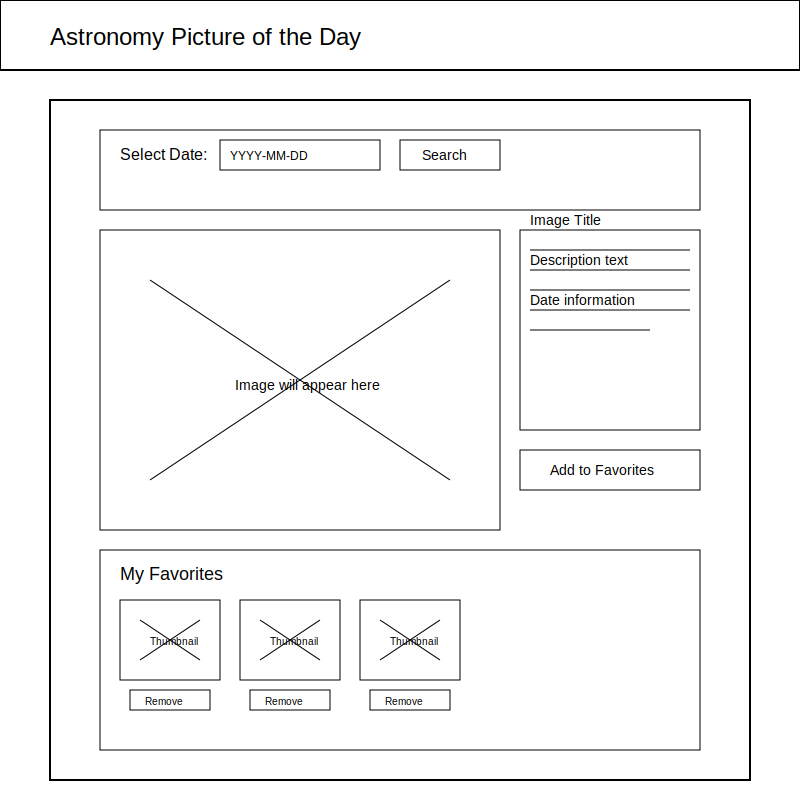

# Stellar View: NASA APOD Explorer

A responsive web app for exploring NASA's Astronomy Picture of the Day (APOD). Search by date, view stunning space images with explanations, and save favorites locally. Built as my capstone project for MTM6302, showcasing modern web development skills.

## Features
- **Date-Based Search**: Fetch APOD images and details from NASA's API for any date since 1995.
- **Favorites Management**: Add/remove favorites with local storage persistence; view and manage your collection.
- **Multi-Page Navigation**: Smooth SPA-like transitions between Home, Favorites, and About pages.
- **Responsive Design**: Mobile-first layout that works seamlessly on phones, tablets, and desktops.
- **User-Friendly UI**: Loading indicators, error handling, toast notifications, and keyboard accessibility.
- **Accessibility-Focused**: WCAG 2.1 AA compliant with semantic HTML, ARIA labels, and proper contrast.

## Tech Stack
- **HTML5/CSS3**: Semantic structure, CSS Grid/Flexbox for layouts, custom space-themed styling.
- **Vanilla JavaScript (ES6+)**: Fetch API for data, event delegation, async/await, localStorage.
- **NASA APOD API**: For fetching daily astronomy data.
- **No Frameworks**: Pure vanilla code for lightweight performance.

## Setup and Running
1. Clone the repo: `git clone https://github.com/Sudip-Shrestha0x0/APOD-App-Semester-3---Capstone-.git`
2. Get a free NASA API key at [api.nasa.gov](https://api.nasa.gov/).
3. Update `script.js` with your key: `const NASA_API_KEY = 'YOUR_API_KEY';`
4. Open `index.html` in your browser (no server needed, but you can use Live Server in VS Code for hot reloading).

Note: The app handles API errors gracefully, but if you hit rate limits, use your personal key.

## Demo
[Live Demo](https://gorgeous-meerkat-b30e06.netlify.app/)

  

## Why This Project?
This app demonstrates my ability to build clean, maintainable code from wireframes to production. I focused on performance (lazy loading, efficient DOM updates), accessibility, and user experience. Challenges like API rate limiting and responsive navigation were solved with modern best practices.

## License
MIT License—feel free to use or modify!

Questions? Reach out at [light0x01@gmail.com].